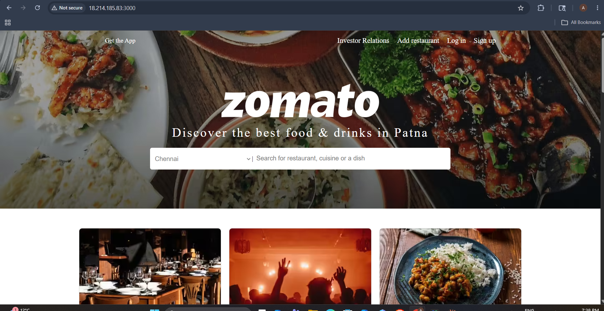
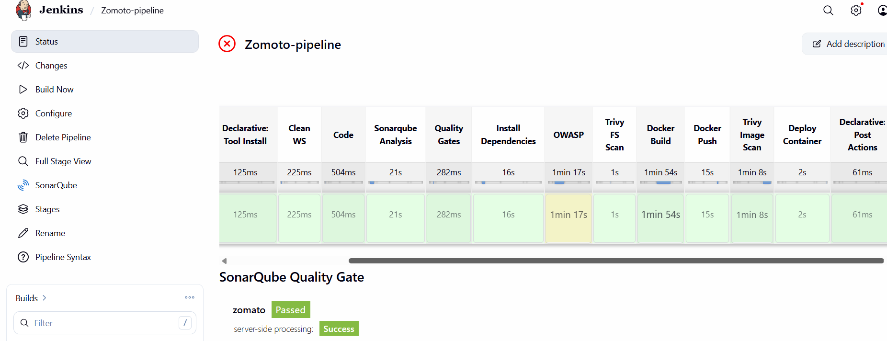
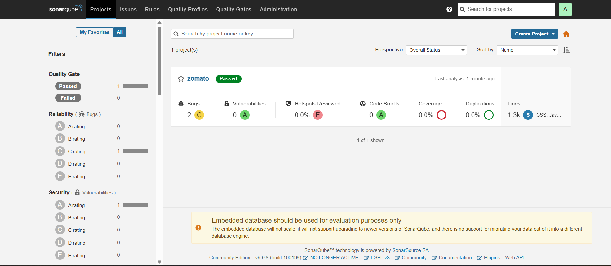
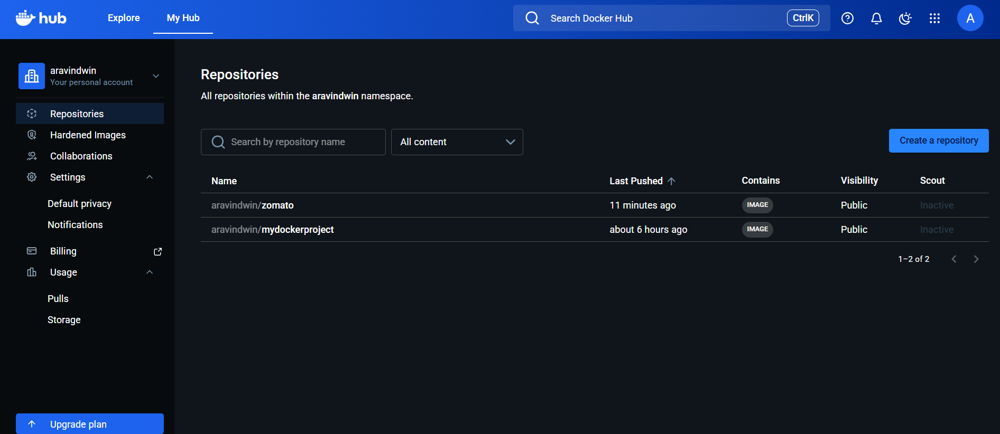
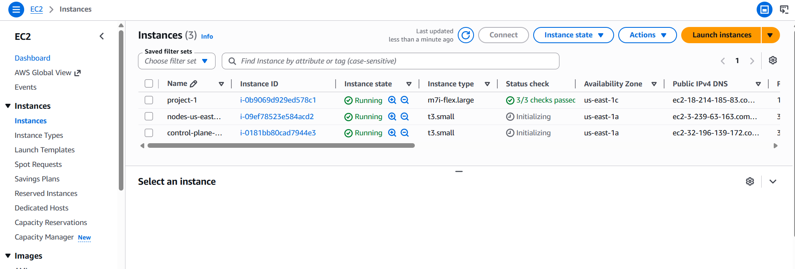
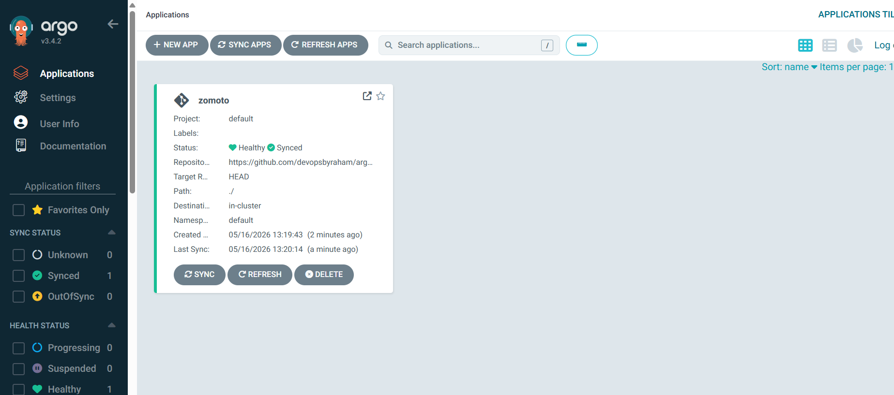

# 🍕 Zomato App — End-to-End DevOps CI/CD Pipeline

A production-grade DevOps project that deploys a Zomato food delivery clone application using a fully automated CI/CD pipeline on AWS — covering code quality, security scanning, containerisation, and GitOps-based deployment.

---

## 🚀 Live Demo

> Application deployed and accessible at: `http://18.214.185.83:3000`  
> *(AWS EC2 instance — may be stopped to avoid charges)*

---

## 🏗️ Architecture Overview

```
Developer Push (GitHub)
        │
        ▼
┌─────────────────┐
│   Jenkins CI    │  ← Hosted on AWS EC2 (m7i-flex.large)
│   13-Stage      │
│   Pipeline      │
└────────┬────────┘
         │
    ┌────┴─────────────────────────────────────────┐
    │                                              │
    ▼                                              ▼
SonarQube Analysis                        OWASP Dependency Check
Quality Gate ✅                           Security Scan ✅
    │                                              │
    └──────────────┬───────────────────────────────┘
                   │
                   ▼
         Trivy File System Scan ✅
                   │
                   ▼
         Docker Build & Push
         → aravindwin/zomato:latest
                   │
                   ▼
         Trivy Image Scan ✅
                   │
                   ▼
         Deploy Container on EC2
                   │
                   ▼
         ArgoCD (GitOps Sync) ✅
         Status: Healthy + Synced
```

---

## 🛠️ Tech Stack

| Category | Tools Used |
|---|---|
| Cloud | AWS EC2, AWS EKS |
| CI/CD | Jenkins |
| Code Quality | SonarQube |
| Security Scanning | OWASP Dependency Check, Trivy |
| Containerisation | Docker, Docker Hub |
| GitOps | ArgoCD v3.4.2 |
| Source Control | GitHub |
| OS | Amazon Linux 2023 |

---

## 📋 Jenkins Pipeline Stages

The pipeline consists of **13 automated stages**:

| # | Stage | Description |
|---|---|---|
| 1 | Declarative: Tool Install | Install required tools |
| 2 | Clean WS | Clean workspace before build |
| 3 | Code | Checkout source code from GitHub |
| 4 | SonarQube Analysis | Static code analysis |
| 5 | Quality Gates | Enforce SonarQube quality gate |
| 6 | Install Dependencies | Install npm/app dependencies |
| 7 | OWASP | Dependency vulnerability scan |
| 8 | Trivy FS Scan | File system security scan |
| 9 | Docker Build | Build Docker image |
| 10 | Docker Push | Push image to Docker Hub |
| 11 | Trivy Image Scan | Container image vulnerability scan |
| 12 | Deploy Container | Deploy app on EC2 |
| 13 | Declarative: Post Actions | Cleanup and notifications |

---

## ✅ SonarQube Quality Gate Results

| Metric | Result |
|---|---|
| Quality Gate | ✅ Passed |
| Bugs | 2 (C rating) |
| Vulnerabilities | 0 (A rating) |
| Security Hotspots | 0.0% |
| Code Smells | 0 (A rating) |
| Lines of Code | 1.3k |

---

## 🐳 Docker Hub

Image published at: `docker.io/aravindwin/zomato:latest`

```bash
# Pull and run the image
docker pull aravindwin/zomato:latest
docker run -d -p 3000:3000 aravindwin/zomato:latest
```

---

## 🔄 ArgoCD — GitOps Deployment

| Property | Value |
|---|---|
| Application | zomato |
| Status | ✅ Healthy + Synced |
| Repository | GitHub |
| Namespace | default |
| Destination | in-cluster |
| ArgoCD Version | v3.4.2 |

ArgoCD continuously monitors the GitHub repository and automatically syncs any changes to the Kubernetes cluster — ensuring the deployed state always matches the Git state.

---

## ☁️ AWS Infrastructure

| Instance | Type | Purpose |
|---|---|---|
| project-1 | m7i-flex.large | Jenkins + App Server |
| nodes-us-east | t3.small | EKS Worker Node |
| control-plane | t3.small | EKS Control Plane |

---

## 🚀 How to Run This Project

### Prerequisites
- AWS Account
- Docker installed
- Jenkins installed on EC2
- kubectl configured
- ArgoCD installed on cluster

### Steps

```bash
# 1. Clone this repository
git clone https://github.com/aravindboopathy99-debug/<repo-name>.git

# 2. Set up Jenkins pipeline
# - Create new pipeline job in Jenkins
# - Point to this repo's Jenkinsfile
# - Add credentials: DockerHub, SonarQube token, AWS

# 3. Run the pipeline
# Trigger build in Jenkins — all 13 stages run automatically

# 4. Verify deployment
docker ps
# Should show: aravindwin/zomato:latest running on port 3000

# 5. Access the application
# Open: http://<your-ec2-ip>:3000
```

---

## 📸 Screenshots

| Component | Screenshot |
|---|---|
| Zomato App Running |  |
| Jenkins Pipeline |  |
| SonarQube Results |  |
| Docker Hub |  |
| AWS EC2 Instances |  |
| ArgoCD Synced |  |

---

## 📚 Key Learnings

- Built a real-world 13-stage CI/CD pipeline from scratch using Jenkins
- Integrated security scanning at multiple levels (OWASP + Trivy FS + Trivy Image)
- Implemented GitOps using ArgoCD for automated, drift-free deployments
- Managed containerised workloads on AWS EC2 and EKS
- Enforced code quality gates using SonarQube before every deployment

---

## 👨‍💻 Author

**Aravind Boopathy**  
DevOps Engineer | AZ-104 | Terraform Associate  
📍 Ontario, Canada  
🔗 [LinkedIn](https://www.linkedin.com/in/aravind-boopathy-19049337a/)  
🐳 [Docker Hub](https://hub.docker.com/u/aravindwin)

---

## ⭐ If you found this project useful, please give it a star!


